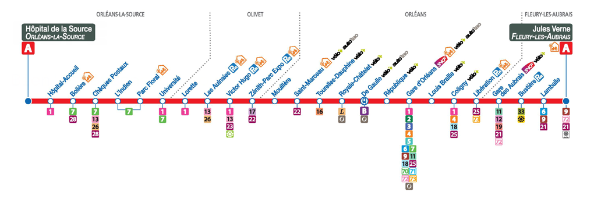
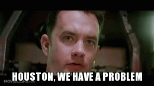
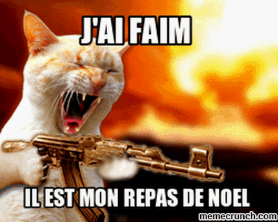

# 🏃 Sprint Cryptographie 🏃

/!\ ordre chronologique douteux ... /!\

7h20 ⏰ le réveil sonne, on se brosse les dents on s'habille en deux deux et direction le sprint de crypto. Après 30 minute de tram on arrives a la FAC d'Orléans. 8h00 😴, un jolie chiffre l'heure d'arrivée a la FAC mais aussi la durée de sommeil cumulé des trois participant de l'équipe Lauriot ... 

On pose nos affaires et la coup dur, ou plutôt merveille problèmes git suivie de problème de config. Un moment de répis pour prendre notre meilleur café ☕

Problèmes résolu enfin prêt à commencer, directions les problèmes historique comme si nos problèmes de sommeil n'était pas suffisant, on commence par une attaque gratuite, on nous rappel notre levée difficle, et ensuite on nous parle de notre rêve un lit certe en désordre mais un lit tout de même. Est la soudain un écran d'ordinateur avec un texte qui ressemble a tout sauf du français, encore une personne qui as trop abuser des boissons la veilles 🍺 Et après c'est à des pauvre étudiant en manque de sommeil de rattraper les bêtise de monsieur, je vous félicite pas ... bon coup de chance c'était un code ceasar plutôt simple à déchiffrer. 

Oh une image avec les arrêts de la ligne A du tram, c'est gentils de penser a comment nous allons pouvoir rentrer. Quelque chose me dit qu'il y'a quelque chose dans cette image ...




Hmmm ...



Abort the mission ! Si c'est l'image qui le dit ont va pas la contredire, en plus on est fatiguer je rappel il ne faudrais pas trop travailler 🥱

Bon et si on aller ce promener dans le batiment 3IA ... Trop bien un QrCode 😮

[](https://www.youtube.com/watch?v=iik25wqIuFo)

On avais du temps a perdre du coup on as coder un super truc si vous cliquer sur le Qr 😉

On dirais qu'il y'a pas de token ici non plus 😥 

bon c'était marrant de ce promener mais retour en E09 pour travailler, on commence à avoir faim ça creuse de marcher.



heureusement on as eu un buffet avec pas mal de fruit

```py
msg = """
🥦🥝 🥬🧄🍐🍒🍎🍊 🍈🌶🥔 🥝🥭🍊 🍊🍐🥝🥭 🥬🍎🥑🌽🥦🥝 🍎 🍒🍎🌶🌽🍈🍉🥦🥝🍐. 🌽🥦 🥭🍉🥬🥬🌽🍊 🥕🥝 🥦🌽🍐🥝 🥦🍎 🍐🥬🥑 🐯🐹🦁🐻
🍈🧄🍉🍐 🥭'🥝🌶 🥑🧄🌶🍅🍎🌽🌶🥑🍐🥝
...
"""

correspondance = {
    "🍎": "a",
    "🥝": "e",
    "🍊": "t",
    "🥭": "s",
    "🍈": "p",
    "🍑": "h",
    "🍐": "r",
    "🧄": "o",
    "🍓": "y",
    "🥦": "l",
    "🌽": "i",
    "🥬": "f",
    "🥑": "c",
    "🍉": "u",
    "🥔": "g",
    "🍅": "v",
    "🥕": "d",
    "🌶": "n",
    "🍒": "m",
    "🥥": "b",
    "🍋": "z",
    "🍆": "k",
    "🥒": "w",
    "🍇": "j",
    "🧅": "q",
    "🍏": "x",
    "🐼": "1",
    "🐻": "3",
    "🐶": "7",
    "🦁": "8",
    "🐹": "0",
    "🐯": "2",
    "🦊": "6",
    "🐭": "5",
    "🐰": "4",
    "🐱": "9"
}
```

vendredi matin, rebelote notre sommeil n'as pas était en s'arrangeant. Surprise la machine a café ne sert pas de latté caramel.

